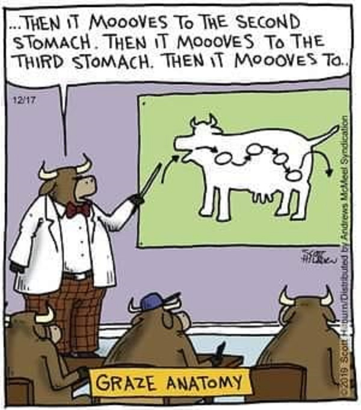

# Modern Human Anatomy Capstone Poster Requirements

This page details the required sections for a poster presented in the MHA Poster session held every April.

## Required Sections  

- [Title](#title)
- [Background and Rationale](#background-and-rationale)
- [Methods](#methods)
- [Results](#results)
- [Discussion / Broader Impacts](#discussion)
- [Acknowledgements](#acknowledgements)

### Optional Section

- [References](#references-optional)

### Title

- Be descriptive - the title should be the PUNCHLINE of your report
- Use a Large sans-serif Font (e.g. 80 point Arial)

### Author(s)

- You should be the first author on your poster as the Presenting Author
- Your mentor should be listed the final author.
- Any other authors you list should have some direct involvement in the production of your capstone project (see box below).
- Your capstone committee members are not automatically be part of the author list.
  - If not listed as an author, you should acknowledge your committee members in the acknowledgment section of the poster.

!!! note "A note on authorship"

    Perhaps the most widely established requirements for authorship are the [Vancouver criteria](http://www.icmje.org/recommendations/browse/roles-and-responsibilities/defining-the-role-of-authors-and-contributors.html#two) established by the International Committee of Medical Journal Editors in 1988. These specify that authors must do all of four things to qualify: 
    - play a part in designing or conducting experiments or processing results
    - help to write or revise the manuscript
    - approve the published version
    - take responsibility for the article’s contents. 
    
    Always obtain **explicit permission** from each author to include them in the authorship list of any presentation, abstract, or paper. If they don't give you permission (or don't respond), don't list them as an author.

### Logos

- Make sure to credit  the MHA Program as your home department even if your mentor is in a different department
- Make sure to use one of the Category icons in your title section

- 

-   :fontawesome-solid-people-line: **Logos and Categories**
  
    ---
    
    :material-arrow-right: [MHA Logos](https://olucdenver.sharepoint.com/:f:/s/mhacapstone/Eo5VJiLqi45Dgl2gg-6vu38BTJtioks_lOm5O-I28hyOAg?e=Rl59x9)

### Background and Rationale

This section should provide an overview of your project. Avoid verbose prose. Use bold text and  bullet points to emphasize key concepts.

Include a logical hypothesis or statement of the problem. Connections to previous literature may be included here (cited properly). Clearly state the purpose or goal of the project in this section. Address this statement: why is this question worth exploring? Include you project specific aims in this section.

You should also include an illustrative cartoon/diagram about the anatomy in question.

{ width="250"}

### Methods

*aka the Project Approach*

Your methods section should summarize the techniques you used. Avoid verbose prose. Use **bold text**

* and  bullet points

to emphasize *key* concepts.

This section is not a detailed protocol list.

Be sure to include an explanatory figure:

{ width="450"}

This [Nature Methods figure](http://www.nature.com/nmeth/journal/v10/n5/fig_tab/nmeth.2434_F1.html) nicely illustrates the imaging methodology being used (light sheet), along with the fact that a zebrafish is being imaged (a). It only includes the information pertinent to the methodology (for example, the entire microscope is not being depicted here, only the objectives lenses used to illuminate and detect). This figure also highlights the fact that a volume of image data is being acquired (b) and includes pertinent facts such as the depth of the volume and the x and y dimensions of each slice, the distance between each slice, and the time it takes to capture the information.

### Results

Remember, you want to present your results in a clear, informative, and creative manner. But don't get too creative and  do not mislead.

![XKCD - test results][test-results]{width=350px}

[test-results]: https://imgs.xkcd.com/comics/rapid_test_results.png

The only text you need in this section are titles to summarize figures and figure legends to provide necessary details (an no more) about a figure.

Instead of having lots of separate figures, group related figures into Lettered panels of the same figure.

### Discussion

 Where you discuss the Broader Impacts of your findings.

- More  Bullet Points!
- List the main conclusions of your results
- And the future implications of your results ...
- Summarize the overall scientific/academic value and significance of your project.
  - How does your work contribute to the field of anatomical sciences, and imaging and modeling?
  - Or List the further steps needed to capture statistically significant results
- List possible future directions that could build on your work

### Acknowledgements

Acknowledge the contributions of non-authors here. Usually these are individuals who have reviewed your materials and have given you feedback on your project (e.g., your MHA capstone committee). Also, be sure to mention any funding that may have supported your project such as the NIH.

### References (optional)

References are optional and usually NOT included

If you do decide to include references, you may refer to them using numbers$^{1,2}$ to save space.

### Blast From the Past

Review past Capstone Project posters that we have posted on the [MHA Capstone Shared Resources Site](https://olucdenver.sharepoint.com/sites/mhacapstone/Shared%20Documents/Forms/AllItems.aspx).

## Poster Mechanics

### Software

- **Basic Software**: use Microsoft Powerpoint (or Apple Keynote)

- **High-end Software**: Adobe Illustrator

### Poster Dimensions

- Recommended Poster Dimensions: 48" x 36"

### Font Typeface and Sizes

- Typeface: sans-serif (eg. Arial or Helvetica)
- Title: 80 pt
- Section Headers: 70-point

### Image Resolution

Images should be 300 dpi

### Convert to PDF

Before you submit your poster for printing, you should convert it to a PDF. 

Follow these [instructions](https://phdposters.com/convert_to_pdf.php)

### Templates

Here is a template: [Template](assets/48X36-Black-Gold.pptx)
