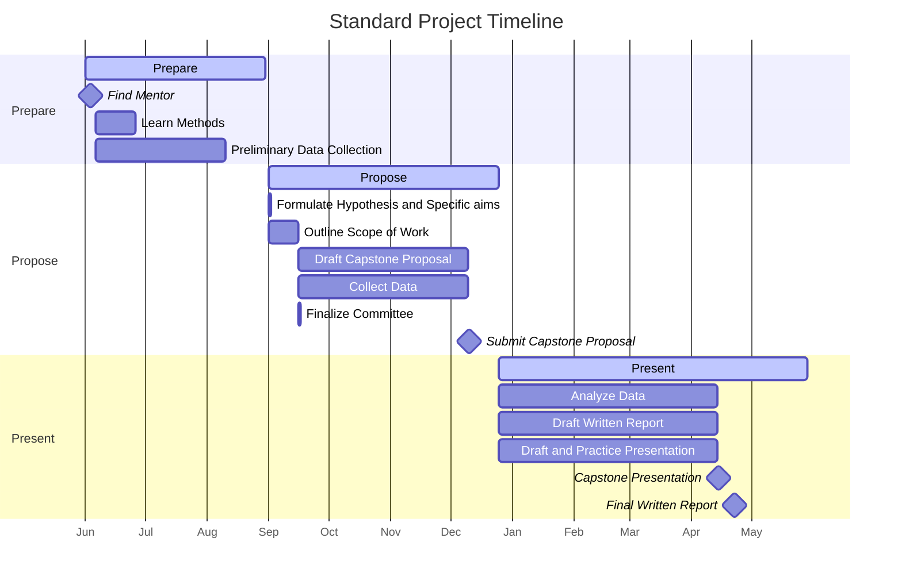
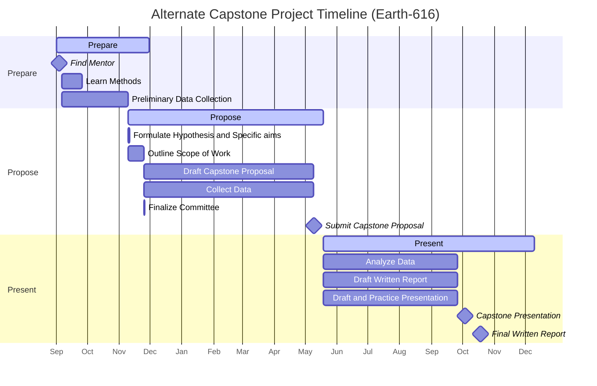

# Timeline

## Standard Timeline

The following timeline is recommended for successful completion of the Capstone Project by the end of your second year.

As you can see, we break the timeline down into roughly three phases:

- **Prepare**: Select a Mentor, learn methods, and explore hypotheses
- **Propose**: Finalize your Hypothesis and establish the Scope of Work
- **Present**: Present your findings in a public forum (e.g. Poster Presentation). Write up your results in a Written Report.

Although, the official Standard Timeline for the Capstone Project starts in the fall and is completed in the spring of the second year of your MHA tenure, **we strongly recommend** that you start in the summer to begin the Prepare Phase. Two semesters is rarely enough time to complete the project.

The standard timeline can easily be extended into the summer if additional time is needed for data collection or analysis. In this case, you would simply present your findings as a talk. Students who present in the summer can still graduate on time and with their fellow cohort.

## Alternate Timelines

Based on your personal trajectory, the standard timeline may not work for you. In that case, you are going to need to develop your own personal Capstone Timeline. But the sequence of events and milestones should remain roughly the same.

For example, the following timeline starts in the Fall of Year two and finishes a year later.

Notice that for both timelines, a submitted Capstone Proposal is required before you start to write up the Final Written Report. Also, n the alternate timeline, your presentation will most likely be a talk instead of a poster. Otherwise, everything else will be pretty much the same. 