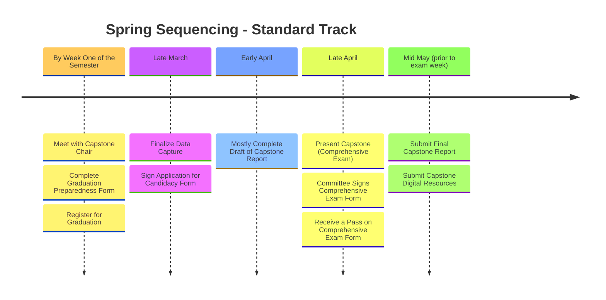

# Final steps for completing your Capstone Project

Successful completion of the Capstone Project is a requirement for both the Modern Human Anatomy program and the Graduate School. In fact, the Graduate School requires that the Capstone Presentation and Report be (mostly[*](https://modernhumananatomy.github.io/MHACapstone/capstone-evaluation/#criteria-for-a-pass)) completed before you can participate in the Spring Commencement Ceremony of Graduation.  

The following timeline is sequenced for Standard Track students in the Spring Semester of their second year. Students on the Alternate Track who plan to complete their project in a different semester should sequence their timeline accordingly.

- **Capstone Proposal:** The completed [Capstone Proposal](capstone-proposal-guidelines.md){target="_blank"} must be submitted prior to the start of the semester. This proposal will be used as a guide for what you proposed to do and what remains to be completed.
- **Graduation Preparedness Checklist:** You should meet with your Capstone Chair and fill out the Graduation Preparedness form before the end of first week of the semester to ensure enough time to register for Graduation.

!!! abstract "Graduation Preparedness Checklist"

    Complete this checklist with your Capstone Chair to review your readiness to graduate. Use your Capstone Proposal as a guide for what needs to be completed two weeks prior to the Presentation. By now, you should have a good idea of what should be feasible to complete before the deadline.

    [:material-file-document: Spring 2026](assets/Graduation%20Preparedness%20Checklist%202026.pdf){ .md-button target="_blank"} [:material-file-document: Template](assets/Graduation%20Preparedness%20Checklist%20Template.pdf){ .md-button target="_blank"}

- **Register for Graduation:** You should register for Graduation in your final semester.
- **Application for Candidacy:** Once the checklist is completed and you have registered for Graduation, the MHA administration (i.e. Jennifer) will fill out the Graduate School Application for Candidacy. The graduate school will then electronically distribute this application to you and your Capstone committee for your signatures.
- **Final Draft of Capstone Report:** You must submit a [nearly complete draft](https://modernhumananatomy.github.io/MHACapstone/capstone-evaluation/#criteria-for-a-pass){target="_blank"} of the [Capstone Report](capstone-report-guidelines.md){target="_blank"} at least two weeks prior to the presentation. This draft should require only minor revisions and/or some minor data analysis.
- **Capstone Presentation:** You must present your Capstone in a Public Forum (either as a Poster or a Slide Talk). This Presentation also serves as a major component of the Comprehensive Exam for the Graduate School. Therefore, to participate in Spring Commencement, you must present your Capstone prior to Finals Week AND receive a "Pass" on the Comprehensive Exam Signature Form.
- **Comprehensive Exam Signature Form:** This form is electronically distributed by the Graduate School to the members of the Capstone Committee. The form has three options: 1) Pass, 2) Pass with conditions, and 3) Fail. All committee members must sign off on a "Pass" for the student to participate in Spring Commencement. Note, the outcome from this form is separate from the final grade you will receive on your Capstone Project. You can read more about this form on the [evaluation page](capstone-evaluation.md){target="_blank"}.

As you can see, there is very little flexibility in these deadlines. Standard Track students unable to meet the above deadlines can extend the timeline into the summer to wrap up their project, but they will be unable to participate in Commencement.

!!! danger "Prioritize Core MHA Courses"

    Remember, it is far more important to successfully pass core MHA classes, such as Gross Anatomy or Embryology, than to participate in Spring Commencement. If this timeline interferes with your ability to pass a course, you should prioritize passing the course and then completing the capstone project afterward. Capstone projects can easily be completed in the summer once all core MHA courses have been passed.
