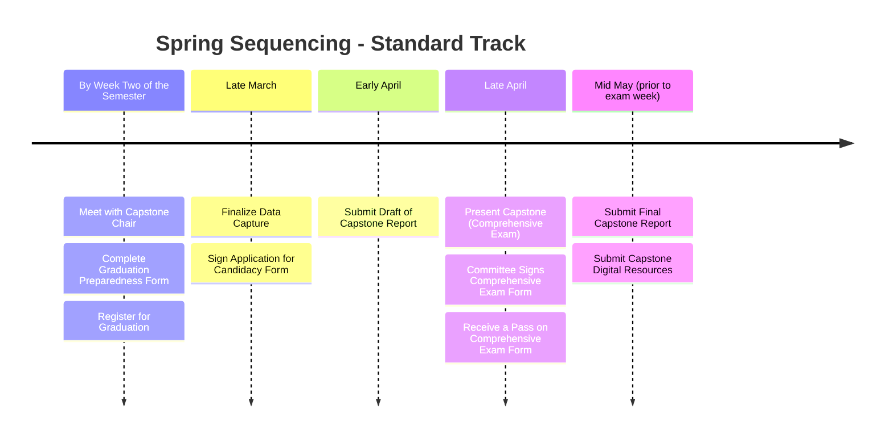

# Final steps for completing the Capstone Project

Successful completion of the Capstone Project is a prerequisite for graduation from the Modern Human Anatomy program and, by extension, the Graduate School. As such, capstone assignments must be completed alongside other actions required by the Graduate School. The timely completion of these actions is especially critical for students on the Standard Track who wish to participate in the Spring Commencement of their final year.

The following timeline is sequenced for Standard Track students in the Spring Semester of their second year. Students on the Alternate Track who plan to complete their project in a different semester should sequence their timeline accordingly.

- **Meeting with your Capstone Chair** and filling out the Graduation Preparedness form must occur before or in the first two weeks of the semester to ensure enough time to register for Graduation.
- **Graduation Preparedness form:** This MHA form is designed to help you and your Capstone chair review your progress, using your Capstone Proposal as a guideline. This means that a completed Capstone Proposal is a prerequisite for this meeting—without one, you cannot fill out the form. Filling out this form should help determine if you have made enough progress on your project to graduate that semester.
- **Application for Candidacy:** This form is filled out by MHA administration and then electronically distributed by the Graduate School for signatures. Your signature and your Capstone Chair's signature are required on this form.  
- **Draft of Capstone Report:** You must submit a nearly complete draft of the Capstone Report at least two weeks prior to the presentation. This draft should be nearly completed, requiring only minor revisions and/or some minor data analysis.
- **Capstone Presentation:** You must present your Capstone in a Public Forum (either as a Poster or a Slide Talk). This Presentation also serves as a major component of the Comprehensive Exam for the Graduate School. Therefore, to participate in Spring Commencement, students must present their Capstone prior to the end of Finals Week in the Spring Semester AND receive a "Pass" on the Comprehensive Exam Signature Form.
- **Comprehensive Exam Signature Form:** This form is electronically distributed by the Graduate School to the members of the Capstone Committee. The form has three options: 1) Pass, 2) Pass with conditions, and 3) Fail. All committee members must sign off on a "Pass" for the student to participate in Spring Commencement. Note, the outcome from this form is separate from the final grade the student will receive on their Capstone Project. You can read more about this form on the [evaluation page](capstone-evaluation.md).

As you can see, there is very little flexibility in these deadlines. Standard Track students unable to meet the above deadlines can extend the timeline into the summer to wrap up their project, but they will be unable to participate in Commencement.

 !!! danger "Prioritize Core MHA Courses"

    Remember, it is far more important to successfully pass core MHA classes, such as Gross Anatomy or Embryology, than to participate in Spring Commencement. If this timeline interferes with your ability to pass a course, you should prioritize passing the course and then completing the capstone project afterward. Capstone projects can easily be completed in the summer once all core MHA courses have been passed.
    