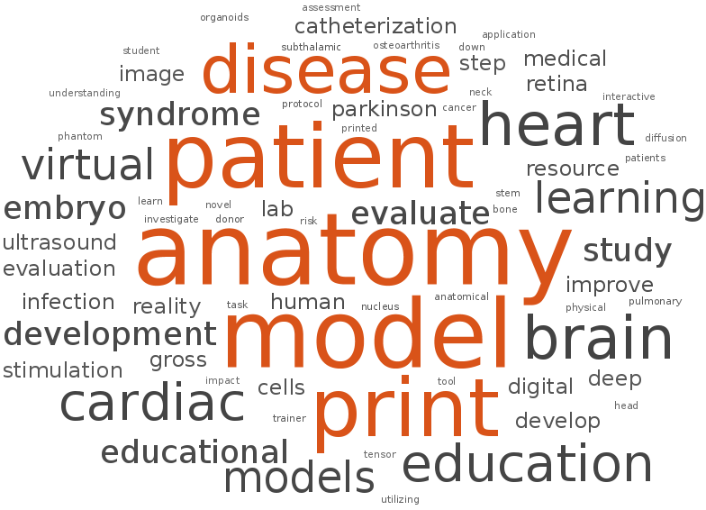
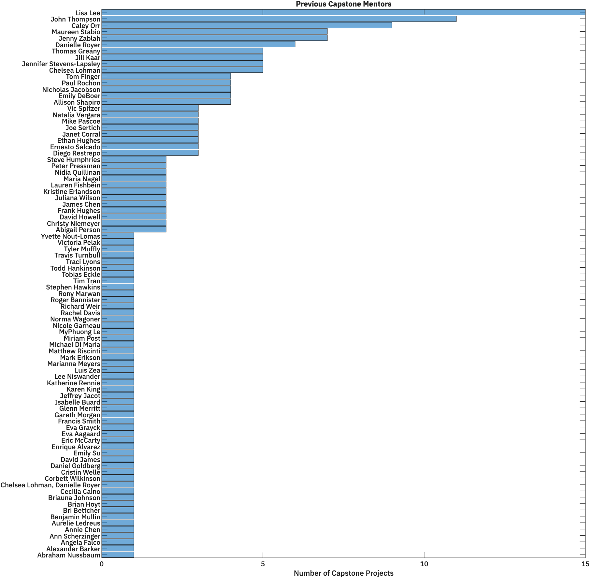
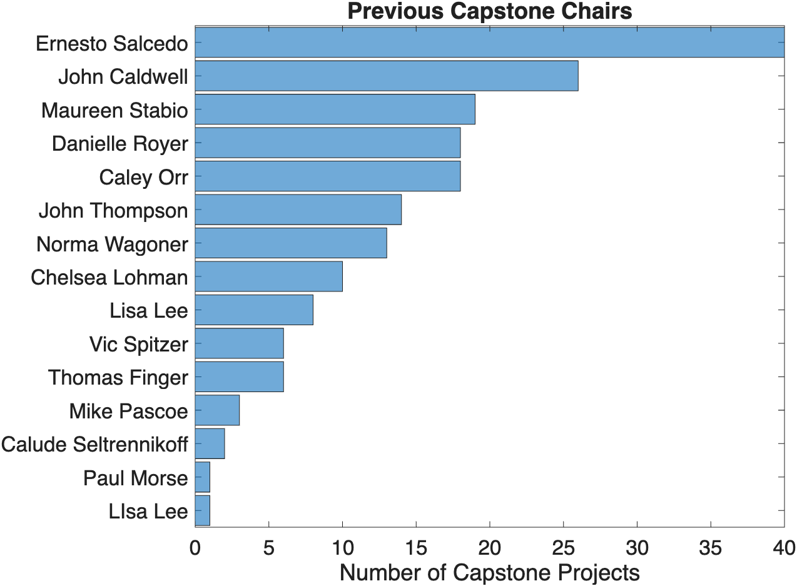

# Finding a Mentor and Creating a Capstone Committee

## The Capstone Committee

The Capstone Project represents an inflection point in your advisement. When you start your Capstone, you build your own team of advisors in the form of the Capstone Committee. This committee comprises the following members:

- The **Capstone Mentor**: the person who helps design the project and provides most of the training
- The **Capstone Chair**: an MHA faculty member who can provide feedback on the project and ensure that the project meets MHA requirements and deadlines. Your Chair can be the same as your First-Year advisor or a different MHA faculty member.
- **Third Committee member**: at least one additional member who can provide feedback on the capstone project, review written documents, and provide training as needed.

At least one committee member must be from outside the core MHA faculty.
  
!!! warning "Choose your Committee Wisely"
    All Committee members will grade your capstone project assignments and determine your final capstone project grade

Once you have identified your Mentor and Capstone Chair, fill out the [Capstone Authorization Packet](assets/Capstone-Authorization-Packet.pdf) and submit to your selected [Canvas Site](initial-steps.md#current-canvas-sites).

## Identifying Potential Mentors

1. Attend the [First-Year Seminar Series](https://medschool.cuanschutz.edu/ms-modern-human-anatomy/curriculum/seminars)
2. Review [Capstone Projects Highlights](https://medschool.cuanschutz.edu/ms-modern-human-anatomy/curriculum/capstone)
3. Read [Past Capstone Project Reports](https://olucdenver.sharepoint.com/:f:/s/mhacapstone/EroeY3SHi5VIlIsCBbOdcDABbqEFODjYFUCNHZ2g9t0xzw?e=z5Uu5f)
4. Talk with your First-Year Advisor
5. Talk with MHA students currently working on their capstone projects
6. Search for interesting research on campus and cold-call (or email) potential mentors

## Previous Capstone Projects

### Word Cloud
{ width="450"}

>Built from the Titles of Previous Capstone Reports.

### Past Mentors

{ width="850"}

> A Histogram of Different Capstone Mentors showing the number of Capstone Projects on which they served as the Mentor

### Previous Chairs

{ width="450"}

> A Histogram of MHA Faculty showing the number of Capstone Projects on which they served as the Chair

### Previous Capstone Projects

Read previous Reports [on our MHA Shared Digital Resources site ](https://olucdenver.sharepoint.com/:u:/s/mhacapstone/EZ3f61b1CItBv5s-I30DU1cB3g79N2lXZbsNuuV4h3eGDQ?e=LZ9kKe)
