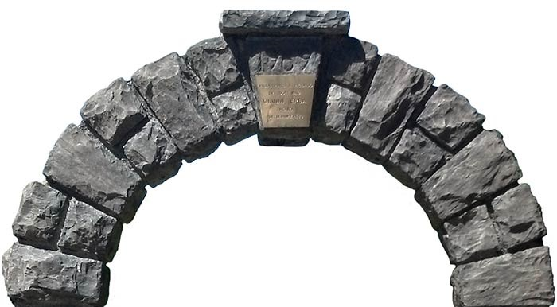

# Modern Human Anatomy Capstone Project Resources Site

Welcome to the Modern Human Anatomy Capstone Project Resources Site. On this site you will find all things **Capstone Project Related** for the [MHA CU Anschutz Master's Program](https://medschool.cuanschutz.edu/ms-modern-human-anatomy).

## What's a Capstone Project?

The Capstone Project is a mentored Research Project that is the culminating experience of the MHA curriculum. For this project, you need to identify and work with a mentor to develop a rationale,  a hypothesis, and an method to answer your hypothesis. Through this project, you will demonstrate the ability to take an idea from conception to implementation to final presentation, combining anatomical knowledge, research capabilities, and professional skills into a comprehensive scholarly deliverable. Completing this project will help you hone the project management skills that will be critical for success throughout your career.

{ width="450"}

To ensure the liberty to pursue the many opportunities offered by the Anschutz Medical Center and surrounding scientific and educational community, we define a capstone project more by its indicators than its precise contents.

!!! abstract "Indicators of a Successful Capstone Project"

    A capstone project should:

    - Result in a novel scholarly deliverable which adds or contributes to an existing body of a knowledge.
    - Reflect a significant level of scholarship and creativity
    - Entail new learning and demonstrate you have gained a new level of expertise.
    - Involve the characterization of a structure (or structures) ranging in scale anywhere from molecular to organismal or gross levels of organization.
    - Include at least one (and preferably more) of the following: 2D images, 3D images, animations or 3D models.

So, your Capstone project should generate new info or expand on current information; it should not just collate what is already known. That is, you must move beyond simply reporting factual information to generating new factual information of your own in a manner that distills the anatomical, research, analytical, and presentation knowledge that you have acquired over the course of your capstone experience.

Also, this is an Anatomy Program, so your Capstone Project should **characterize a biological structure** (or structures) at any scale ranging from the molecular to the organismal to the gross level.

Finally, in recognition of the Modern component our program, your project must also include **some kind of imaging** as part of the analysis. 2D images, 3D volumes, 3D Surface models, and/or 3D Animations all meet this requirement.

## Resources

- [Previous Capstone Proposals](https://olucdenver.sharepoint.com/:f:/s/mhacapstone/EuzDaZoetV9EgLzT6qNequ0BfJBQPiiUEis3Es9v4ELsFA?e=FRIjTG)
- [Previous Capstone Reports](https://olucdenver.sharepoint.com/:f:/s/mhacapstone/EroeY3SHi5VIlIsCBbOdcDABEGrHFUMwwgh1v8L4n-DrYA?e=gGyiaL)

-   ::material-run-fast:: [**Getting Started**](initial-steps.md)

