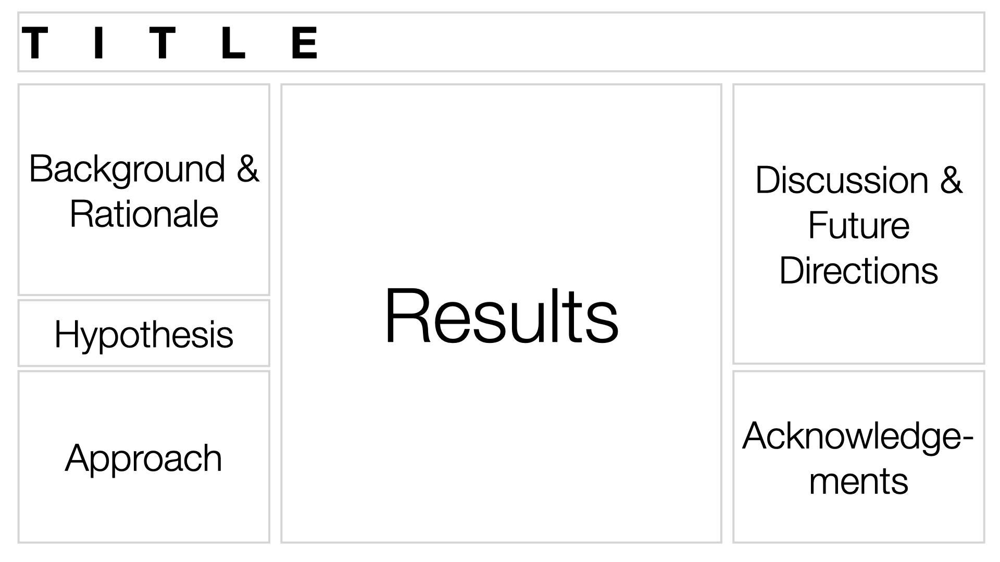
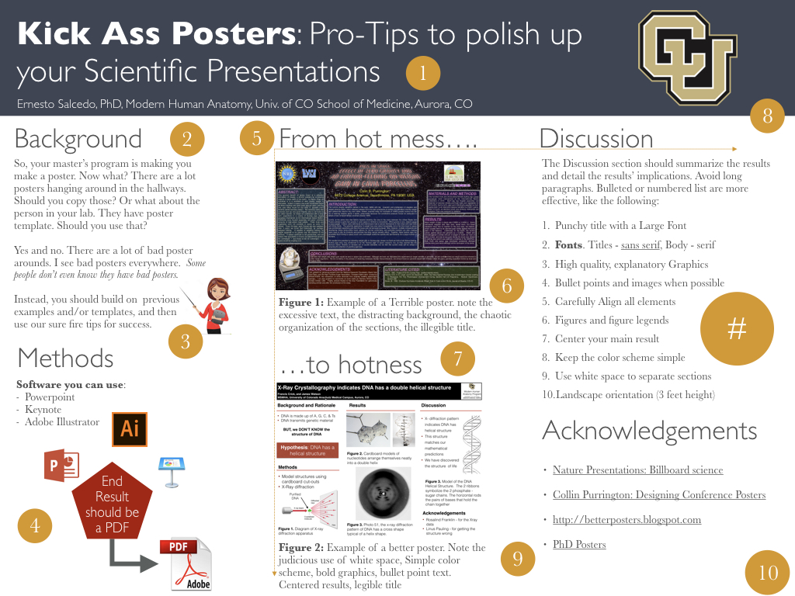

# General Guidelines for Making a Scientific Poster

Scientific communication is an essential skill to have for the budding Biomedical Researcher.

## Useful References

- [Lecture - Poster Organization](assets/LECTURE5-Poster-Presentation.pdf)
- [Better Posters](http://betterposters.blogspot.com/)
- [Poster as a teaching experience](https://www.science.org/doi/10.1126/science.aab0014)
- [PLOS COMP BIO: Ten Simple rules for Better Figures](https://journals.plos.org/ploscompbiol/article?id=10.1371/journal.pcbi.1003833)
- [Nature: Presentations: Billboard Science](https://www.nature.com/articles/nj7387-113a)

## Logical Flow

Posters are like the comic book version of your written report in that they should be very visual and have a logical flow. 

![][i_scientist]

[i_scientist]: https://imgs.xkcd.com/comics/correlation.png

Note that this [XKCD](https://xkcd.com) comic strip uses both section boxes and relies on the convention of reading from left to right to organize the flow of information.

Most Scientific posters organize information a little differently: first from top to bottom, then from left to right.

{ width="500"}

!!! note "A word about Boxes"

    People will often organize the different sections of a poster using boxes. While this can be a useful approach, it can sometimes make the poster look a little cluttered and difficult to manage (if you want to resize just one column, you have to resize all of the boxes).
    
    Often, a judicious use of white space can be equally as effective as creating boxes and not as distracting.

    Try this approach before you start boxing everything:

    1. Start with a simple grid: Try three equal columns if flummoxed.
    2. Make the margins between the columns wide. Clearly defined margins will help guide people in which way to read.
    3. Make your material fit the grid; don’t change the grid to fit the material. You may have to go back and redo graphs to different proportions.

    If you feel you still need to add a box, try just adding one for extra emphasis.

    Click for more on boxiness [here](http://betterposters.blogspot.com/2010/02/boxism.html).

## Visual Appeal

A poster should be visually appealing. Think of a poster as a billboard advertisement of your work.

**Be sure to USE:**

- Bold, high quality Graphics
- Plenty of White Space
- Limited text
- A limited number of colors (no more then two contrasting colors recommended)

**Be sure to AVOID:**

- Large blocks of texts.
- Large Impenetrable Tables
- Using dark or noisy backgrounds
  - (White Backgrounds with dark text are easier to read)
- Confusing organization
- Pointless 3D styling
- Too many colors

{ width="750"}

A great example of a BAD POSTER  - note the excessive text, the distracting background, the chaotic organization of the sections, the illegible title. [Top 20 Reasons why this is a terrible poster](http://colinpurrington.com/2012/example-of-bad-scientific-poster/) 

Nobody wants to read all this. People want to get the gist of the poster from a just a glance

Remember, you will be standing there to present your poster, so your poster does not and *should not* contain all the detail that is available in your written report.

Instead, your poster should be **eye-catching**. Sell your results. Poster Sessions are usually large events with lots and lots of posters. You want yours to stand out.

That being said, you poster should also be informative. Be creative in the way you display this information. Refer to this [PLOS COMP BIO article](https://journals.plos.org/ploscompbiol/article?id=10.1371/journal.pcbi.1003833) called "Ten Simple Rules for Better Figures" for more information on how to make better figures.

## Tips for creating Eye-Catching Posters

### Pro-tips

{ width="800"}

1. Punchy title with a Large Font (to read from afar). Title should be the punchline of the poster. **[Titles are 90% of your Poster](https://betterposters.blogspot.com/2014/07/your-title-is-90-of-your-poster.html) - the take-home message most people will walk away with.**
2. **Fonts**. Use sans serif type fonts (like Helvetica) for titled and serif fonts (e.g. times)  for text in paragraphs
3. Include an explanatory **diagram** for the background when possible. The graphics should illustrate or explain the background in some fashion
4. Use **bullet points** and images whenever possible. Avoid dense paragraphs
5. Carefully **align** elements in a column and across columns (note yellow lines). **Pro-tip:** Match text alignment (eg left-justified) before aligning text boxes
6. The **figure legend** should summarize the result and lists details like number of samples, etc. Instead of dense paragraphs in the results section, detail the information pertinent to the figure in the figure legend.  Make sure each figure stands on its own
7. Position the **main result** close to or in the center of the poster
8. Keep the **color scheme simple** (notice there is one main color used here)
9. Use **white space** to separate sections
10. Use **Landscape** orientation (3 feet height)

*adapted from [Nature: Presentations: Billboard Science](https://www.nature.com/articles/nj7387-113a)*

### Layout

- Choose landscape (horizontal) over portrait (vertical) orientations (if allowable).
- Make sure you allow for white space and large fonts and images.
- Make sure figures are nicely aligned with section headers and text (use the arrange function of your software package)

### Composition

- Use photographs, cartoons or illustrations to explain concepts.
- Place figures in an obvious order, and consider using numbering. 
- Figures should have a large headline with the main finding described in the figure legend
- **Enlarge the best piece of data and place it squarely in the middle at eye level**.

### Text

- Limit the word count to **1,000 words**.
- **Make the title the punchline** of the research—and make it intriguing. Consider placing an engaging image close by.
- Titles and headings should be in a sans-serif font, such as Helvetica. Other text should be in a serif font such as Times New Roman, with a minimum size of 22 points.
- Consider short bullet points for methods and conclusions.
- Use black text on a white background. Red text can be used to draw attention, but avoid blue and yellow, which are hard to read.

### Other considerations

- Have someone else proofread the text.
- Check the poster on a large computer screen at 100%, then step back half a meter from the screen.
- If possible, project the poster onto a wall before printing it to check formatting at actual size.
- Take a fine-line marker pen and white tape with you to the conference to fix any mistakes that you might have missed.
- Prepare a three-five minute elevator pitch of your poster: Don't pin viewers down with an exhaustive tour of the poster.

{ width="200"}
