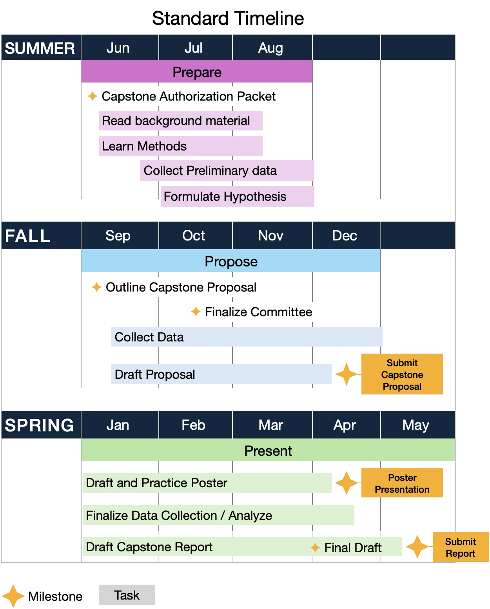
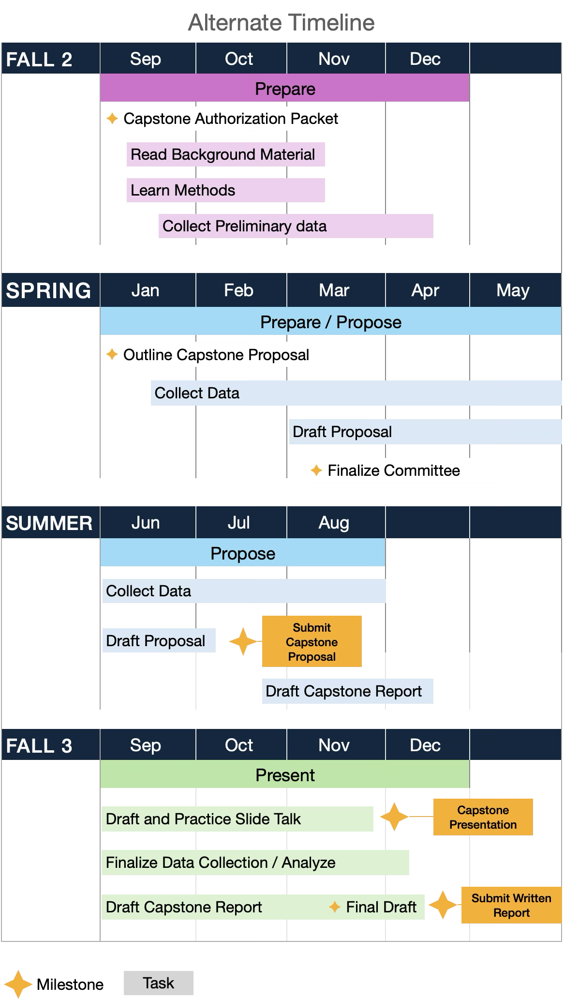

# Capstone Project Timelines

The Capstone Project Timeline is a visual representation of your project's schedule and establishes when tasks and milestone assignments will be completed. There are two timelines that you can follow:

-   :fontawesome-solid-timeline: **[Standard Timeline](#standard-timeline)**
  
    ---
    
    The recommended timeline for successful completion of the Capstone Project by the end of the Second Year

-   :fontawesome-solid-timeline: **[Alternate Timeline](#alternate-timelines)**
  
    ---
    
    A modified timeline to accommodate completion of the capstone project past the second semester of the second year

## Canvas Sites { width="18"}

Each timeline has a dedicated Canvas Site. You can self-enroll into one of these sites on the [Assignments Page](assignments.md).

## Timeline Phases

We break the timeline down into roughly three phases, with the following listed tasks:

### Prepare

- Select a Mentor
- Complete the [Capstone Authorization Packet](assets/Capstone-Authorization-Packet.pdf){target="_blank"}
- Learn methods
- Explore hypotheses
- Complete the Alternate Timeline Worksheet (optional)

### Propose

- Write the [Capstone Proposal](capstone-proposal-guidelines.md) which is designed to finalize:
    - Your Hypothesis
    - Your Specific Aims
    - The Scope of Work of the Project
- Complete Data Collection

### Present

- Complete the Data Analysis
- Present your findings in a public forum (e.g. Poster Presentation).
- Write up your results as Capstone Report.

## Example Timelines

### Standard Timeline

The following timeline is recommended for successful completion of the Capstone Project by the end of your second year.

{ width="550"}

>Here, the bars indicate the tasks that you should be engaged in during the indicated time frame. The gold stars indicate deadlines for Milestone Assignments, such as the Capstone Proposal or the Written report.

The official Standard Timeline for the Capstone Project starts in the fall and is completed in the spring of the second year of your MHA tenure. However, **we strongly recommend** that you start in the summer to begin the **Prepare Phase**. Two semesters is rarely enough time to complete the project. But, if you are unable to take action over the summer, then compress the suggested actions and milestones into the fall semester.

!!! danger "Eligibility to Participate in Graduation Commencement"

    A successfully completed capstone project is a requirement for graduation. In accordance with the Graduate School rules, eligibility to walk for graduation in your second semester requires completion of the following milestones:

    1. **Capstone Proposal** (Mid-December)
    2. **Capstone Report** - Final Draft (2 weeks prior to presentation)
    3. **Capstone Presentation** (Late Spring)

    There's really no wiggle room here. So, please, stick to the timeline if you plan to walk. Read more about the required actions needed to complete your project [on the Final Steps page](final-steps.md). If you are unable to meet the Standard timeline deadlines, you may need to extend your capstone project into the second summer or beyond. 

### Alternate Timelines

Based on your personal trajectory, the standard timeline may not work for you. For example, if you are in the Pathways to Dentistry Track, you will be unavailable to complete the Capstone project by your second year. Or, if you plan on completing your Master's in more than two years, you may want to space out your Capstone Project accordingly. In such cases, you are going to need to develop your own personal Capstone Timeline. But the sequence of events and milestones should remain roughly the same and you should still plan to start your capstone in the summer or fall of your second year.

The following example timeline starts in the Fall of Year two and finishes a year later.

{ width="550"}

Notice that for both timelines, a submitted Capstone Proposal is required before you start to write up the Final Written Report and a draft of the Report is due before the Presentation. In the alternate timeline, the presentation  will most likely be a talk instead of a poster. Otherwise, everything else will be pretty much the same.

-   **Alternate Timeline Worksheet**
  
    ---
    
    Create your own timeline using the Alternate Timeline worksheet—a Microsoft Excel File. You just enter the start and end dates of the Project, and the spreadsheet creates recommended deadlines for the milestone assignments, based on the spacing of the standard timeline.

    :material-download: [Download Timeline Worksheet :material-microsoft-excel:](assets/Alternate-Timeline-Worksheet.xlsx)

