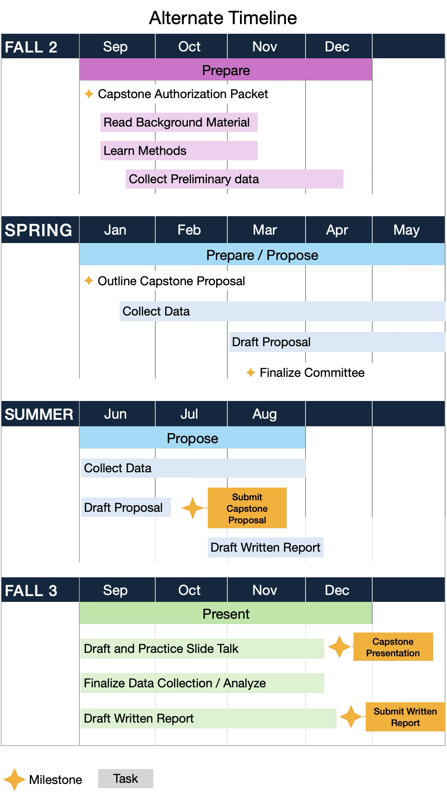

# Capstone Project Timelines

The Capstone Project Timeline is a visual representation of your project's schedule and establishes when tasks and milestone assignments will be completed.

There are two timelines that you can follow:
1. The **Standard Timeline:** The recommended timeline for successful completion of the Capstone Project by the end of the Second Year
2. The **Alternate Timeline:** A modified timeline to accommodate completion of the capstone project past the second semester of the second year

## Standard Timeline

The following timeline is recommended for successful completion of the Capstone Project by the end of your second year.

{ width="550"}

Here, the gray bars indicate the taks that you should be engaged in during the indicated time frame. The gold stars indicate deadlines for Milestone Assignments, such as the Capstone Proposal or the Written report.

As you can see, we break the timeline down into roughly three phases:

- **Prepare**: Select a Mentor, learn methods, and explore hypotheses
- **Propose**: Finalize your Hypothesis and establish the Scope of Work in the Form of a Capstone Proposal
- **Present**: Present your findings in a public forum (e.g. Poster Presentation). Write up your results in a Capstone Written Report.

Although, the official Standard Timeline for the Capstone Project starts in the fall and is completed in the spring of the second year of your MHA tenure, **we strongly recommend** that you start in the summer to begin the **Prepare Phase**. Two semesters is rarely enough time to complete the project. But, if you are unable to take action over the summer, then compress the suggested actions and milestones into the fall semester.

The standard timeline can easily be extended into the second summer if additional time is needed for data collection or analysis. In this case, you would simply present your findings as a talk during the Summer. Students who present in the summer can still graduate on time and walk with their fellow cohort in May.

## Alternate Timelines

Based on your personal trajectory, the standard timeline may not work for you. For example, if you are in the Dental Track, you will be unavailable to complete the Capstone project by your second year. Or, you may want to extend your Capstone into the Second Summer. Or, you plan on completing your Master's in more than 2 years and would like to space out your Capstone Project accordingly. In such cases, you are going to need to develop your own personal Capstone Timeline. But the sequence of events and milestones should remain roughly the same.

For example, the following timeline starts in the Fall of Year two and finishes a year later.

{ width="550"}

Notice that for both timelines, a submitted Capstone Proposal is required before you start to write up the Final Written Report. Also, in the alternate timeline, your presentation will most likely be a talk instead of a poster. Otherwise, everything else will be pretty much the same.

[Alternate Timeline Canvas Site Self-Enrollment](https://ucdenver.instructure.com/enroll/HYNNPW)